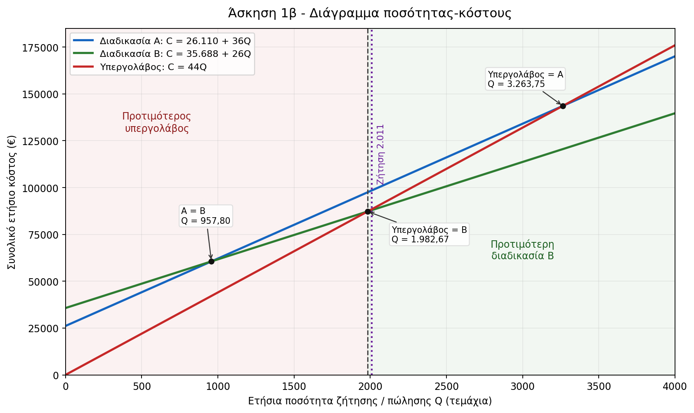

# Άσκηση 1 - Λύση

Δίνεται αύξων αριθμός:

```text
x = 211
```

Άρα η τιμή πώλησης είναι:

```text
P = 52 + x/10 = 52 + 211/10 = 73,10 €/τεμάχιο
```

Τα κόστη γίνονται:

| Επιλογή | Σταθερό κόστος (€) | Μεταβλητό κόστος ανά μονάδα (€) | Συνάρτηση συνολικού κόστους |
|---|---:|---:|---|
| Διαδικασία Α | 24.000 + 10 · 211 = 26.110 | 36 | C_A(Q) = 26.110 + 36Q |
| Διαδικασία Β | 34.000 + 8 · 211 = 35.688 | 26 | C_B(Q) = 35.688 + 26Q |
| Υπεργολάβος | 0 | 44 | C_Y(Q) = 44Q |

Η συνάρτηση εσόδων είναι:

```text
R(Q) = 73,10Q
```

## α) Νεκρό σημείο για τις διαδικασίες Α και Β

Το νεκρό σημείο προκύπτει από:

```text
Q_BE = F / (P - v)
```

Για τη Διαδικασία Α:

```text
Q_BE,A = 26.110 / (73,10 - 36)
       = 26.110 / 37,10
       = 703,77 τεμάχια
```

Επομένως, η ελάχιστη ακέραιη ποσότητα είναι:

```text
Q_BE,A = 704 τεμάχια
```

Για τη Διαδικασία Β:

```text
Q_BE,B = 35.688 / (73,10 - 26)
       = 35.688 / 47,10
       = 757,71 τεμάχια
```

Επομένως, η ελάχιστη ακέραιη ποσότητα είναι:

```text
Q_BE,B = 758 τεμάχια
```

## β) Προτιμότερη επιλογή παραγωγής ή προμήθειας

Επειδή η τιμή πώλησης είναι ίδια σε όλες τις περιπτώσεις, η προτιμότερη επιλογή είναι εκείνη με το μικρότερο συνολικό κόστος.

Οι συναρτήσεις κόστους είναι:

```text
C_A(Q) = 26.110 + 36Q
C_B(Q) = 35.688 + 26Q
C_Y(Q) = 44Q
```

Σημεία τομής:

```text
Α με Β:
26.110 + 36Q = 35.688 + 26Q
10Q = 9.578
Q = 957,80
```

```text
Υπεργολάβος με Α:
44Q = 26.110 + 36Q
8Q = 26.110
Q = 3.263,75
```

```text
Υπεργολάβος με Β:
44Q = 35.688 + 26Q
18Q = 35.688
Q = 1.982,67
```

Άρα:

| Ετήσια ζήτηση Q | Προτιμότερη επιλογή |
|---:|---|
| Q < 1.982,67 | Υπεργολάβος |
| Q = 1.982,67 | Ίδιο κόστος για Υπεργολάβο και Διαδικασία Β |
| Q > 1.982,67 | Διαδικασία Β |

Για ακέραιες ποσότητες:

```text
Q <= 1.982 τεμάχια: Υπεργολάβος
Q >= 1.983 τεμάχια: Διαδικασία Β
```

Η Διαδικασία Α δεν είναι ποτέ η οικονομικά προτιμότερη επιλογή. Για μικρές ποσότητες είναι ακριβότερη από τον υπεργολάβο, ενώ για μεγαλύτερες ποσότητες είναι ακριβότερη από τη Διαδικασία Β.



## γ) Ετήσιο κέρδος αν επιλεγεί η Διαδικασία Α

Η ετήσια ποσότητα πωλήσεων είναι:

```text
Q = 1.800 + x = 1.800 + 211 = 2.011 τεμάχια
```

Το ετήσιο κέρδος με τη Διαδικασία Α είναι:

```text
Π_A = R(Q) - C_A(Q)
    = 73,10 · 2.011 - (26.110 + 36 · 2.011)
```

Υπολογιστικά:

```text
R(2.011) = 73,10 · 2.011 = 147.004,10 €
C_A(2.011) = 26.110 + 36 · 2.011 = 98.506,00 €
Π_A = 147.004,10 - 98.506,00 = 48.498,10 €
```

Άρα η συμβολή της νέας σειράς καθισμάτων στο ετήσιο κέρδος είναι:

```text
48.498,10 €
```

## δ) Αξιολόγηση της επιλογής της Διαδικασίας Α

Για ετήσια ζήτηση 2.011 τεμαχίων, τα συνολικά κόστη είναι:

| Επιλογή | Συνολικό κόστος για Q = 2.011 |
|---|---:|
| Διαδικασία Α | 98.506,00 € |
| Διαδικασία Β | 87.974,00 € |
| Υπεργολάβος | 88.484,00 € |

Άρα η Διαδικασία Α δεν είναι η καλύτερη επιλογή. Η καλύτερη επιλογή είναι η Διαδικασία Β, επειδή έχει το μικρότερο συνολικό κόστος.

Το ετήσιο κέρδος με τη Διαδικασία Β είναι:

```text
Π_B = R(Q) - C_B(Q)
    = 147.004,10 - 87.974,00
    = 59.030,10 €
```

Συνεπώς, με τη Διαδικασία Β το ετήσιο κέρδος θα ήταν:

```text
59.030,10 €
```

Η Διαδικασία Β δίνει μεγαλύτερο ετήσιο κέρδος από τη Διαδικασία Α κατά:

```text
59.030,10 - 48.498,10 = 10.532,00 €
```
