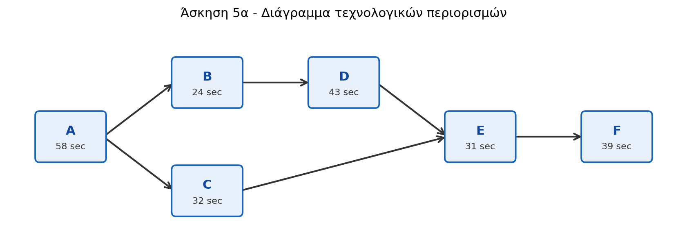

# Άσκηση 5 - Λύση

Δίνεται αύξων αριθμός:

```text
x = 211
```

Οι διάρκειες των εργασιών, μετά τη στρογγυλοποίηση στον πλησιέστερο ακέραιο, είναι:

| Εργασία | Προαπαιτούμενες εργασίες | Υπολογισμός διάρκειας | Διάρκεια |
|---|---|---:|---:|
| A | Καμία | 35 + 211/9 = 58,44 | 58 sec |
| B | A | 24 | 24 sec |
| C | A | 32 | 32 sec |
| D | B | 43 | 43 sec |
| E | C, D | 12 + 211/11 = 31,18 | 31 sec |
| F | E | 20 + 211/11 = 39,18 | 39 sec |

## α) Διάγραμμα τεχνολογικών περιορισμών

Οι τεχνολογικοί περιορισμοί είναι:

```text
A -> B -> D -> E -> F
A -> C -> E -> F
```

Δηλαδή η εργασία Α προηγείται των Β και C, η Β προηγείται της D, οι C και D προηγούνται της E, και η E προηγείται της F.



## β) Χρονικός κύκλος

Η γραμμή πρέπει να παράγει:

```text
40 μονάδες/ώρα
```

Άρα ο απαιτούμενος χρονικός κύκλος είναι:

```text
C = Διαθέσιμος χρόνος ανά ώρα / Παραγωγή ανά ώρα
  = 3.600 / 40
  = 90 sec/μονάδα
```

## γ) Θεωρητικά ελάχιστος αριθμός σταθμών εργασίας

Το συνολικό περιεχόμενο εργασίας είναι:

```text
Σti = 58 + 24 + 32 + 43 + 31 + 39 = 227 sec
```

Ο θεωρητικά ελάχιστος αριθμός σταθμών είναι:

```text
Nmin = ceil(Σti / C)
     = ceil(227 / 90)
     = ceil(2,52)
     = 3 σταθμοί
```

## δ) Κατανομή εργασιών σε σταθμούς

Μία εφικτή κατανομή με 3 σταθμούς εργασίας είναι:

| Σταθμός | Εργασίες | Χρόνος σταθμού | Νεκρός χρόνος |
|---|---|---:|---:|
| 1 | A, B | 58 + 24 = 82 sec | 90 - 82 = 8 sec |
| 2 | C, D | 32 + 43 = 75 sec | 90 - 75 = 15 sec |
| 3 | E, F | 31 + 39 = 70 sec | 90 - 70 = 20 sec |

Η κατανομή είναι εφικτή, επειδή κάθε σταθμός έχει χρόνο μικρότερο ή ίσο από τον χρονικό κύκλο των 90 sec και τηρούνται όλοι οι τεχνολογικοί περιορισμοί.

## ε) Αποδοτικότητα και δείκτης ομαλότητας

Η αποδοτικότητα της γραμμής είναι:

```text
E = Συνολικός χρόνος εργασιών / (Αριθμός σταθμών · Χρονικός κύκλος)
  = 227 / (3 · 90)
  = 227 / 270
  = 0,8407
  = 84,07%
```

Ο συνολικός νεκρός χρόνος είναι:

```text
270 - 227 = 43 sec
```

Ο δείκτης ομαλότητας, με τον συνήθη ορισμό:

```text
SI = sqrt(Σ(STmax - STi)^2)
```

όπου `STmax` είναι ο μεγαλύτερος χρόνος σταθμού, είναι:

```text
STmax = 82 sec
```

```text
SI = sqrt((82 - 82)^2 + (82 - 75)^2 + (82 - 70)^2)
   = sqrt(0^2 + 7^2 + 12^2)
   = sqrt(193)
   = 13,89 sec
```

Άρα:

```text
Αποδοτικότητα = 84,07%
Δείκτης ομαλότητας = 13,89 sec
```

Αν ο δείκτης ομαλότητας υπολογιστεί με βάση τον χρονικό κύκλο `C = 90 sec`, τότε:

```text
SI_C = sqrt((90 - 82)^2 + (90 - 75)^2 + (90 - 70)^2)
     = sqrt(8^2 + 15^2 + 20^2)
     = 26,25 sec
```
