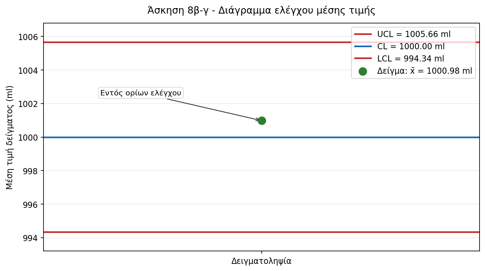

# Άσκηση 8 - Λύση

Δίνεται αύξων αριθμός:

```text
x = 211
```

Η ονομαστική τιμή είναι:

```text
μ = 1000 ml
```

Οι προδιαγραφές είναι:

```text
1000 ± 10 ml
```

Άρα:

```text
LSL = 990 ml
USL = 1010 ml
```

Η τυπική απόκλιση της διαδικασίας είναι:

```text
σ = x / 50 = 211 / 50 = 4,22 ml
```

## α) Φυσικά όρια ανοχών και δείκτης ικανότητας

Τα φυσικά όρια ανοχών της διαδικασίας είναι:

```text
μ ± 3σ = 1000 ± 3 · 4,22
       = 1000 ± 12,66
```

Άρα:

```text
Κάτω φυσικό όριο = 987,34 ml
Άνω φυσικό όριο = 1012,66 ml
```

Ο δείκτης ικανότητας της διαδικασίας είναι:

```text
Cp = (USL - LSL) / (6σ)
   = (1010 - 990) / (6 · 4,22)
   = 20 / 25,32
   = 0,79
```

Επειδή:

```text
Cp < 1
```

η διαδικασία δεν είναι ικανή να ανταποκριθεί στις ποιοτικές απαιτήσεις. Αυτό φαίνεται και από το ότι τα φυσικά όρια ανοχών, 987,34 ml έως 1012,66 ml, είναι πιο πλατιά από τα όρια προδιαγραφών, 990 ml έως 1010 ml.

## β) Διάγραμμα ελέγχου μέσης τιμής

Το μέγεθος κάθε δείγματος είναι:

```text
n = 5
```

Για διάγραμμα ελέγχου μέσης τιμής, τα όρια ελέγχου τριών τυπικών αποκλίσεων είναι:

```text
UCL = μ + 3 · σ/sqrt(n)
CL = μ
LCL = μ - 3 · σ/sqrt(n)
```

Υπολογιστικά:

```text
σ_xbar = σ/sqrt(n) = 4,22/sqrt(5) = 1,8872 ml
```

```text
UCL = 1000 + 3 · 1,8872 = 1005,66 ml
CL = 1000,00 ml
LCL = 1000 - 3 · 1,8872 = 994,34 ml
```



## γ) Έλεγχος δείγματος

Οι τιμές του δείγματος είναι:

```text
1000,3
1000,8
1000,0
1001,7
1000 + x/100 = 1000 + 211/100 = 1002,11
```

Η μέση τιμή του δείγματος είναι:

```text
xbar = (1000,3 + 1000,8 + 1000,0 + 1001,7 + 1002,11) / 5
     = 5004,91 / 5
     = 1000,982 ml
```

Επειδή:

```text
994,34 < 1000,982 < 1005,66
```

η στατιστική του δείγματος βρίσκεται εντός των ορίων ελέγχου. Συνεπώς, το συγκεκριμένο αποτέλεσμα δεν αποτελεί ένδειξη ότι η διαδικασία εμφιάλωσης ήταν εκτός στατιστικού ελέγχου κατά τη στιγμή της δειγματοληψίας.
